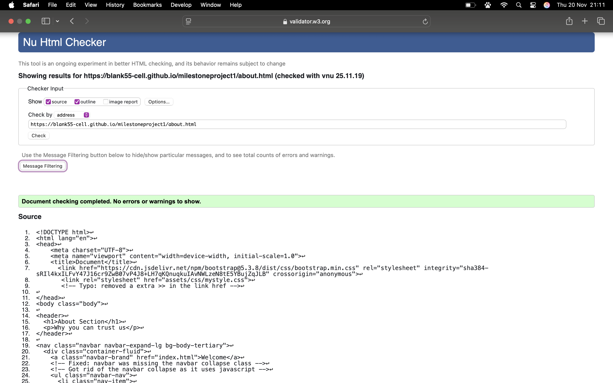
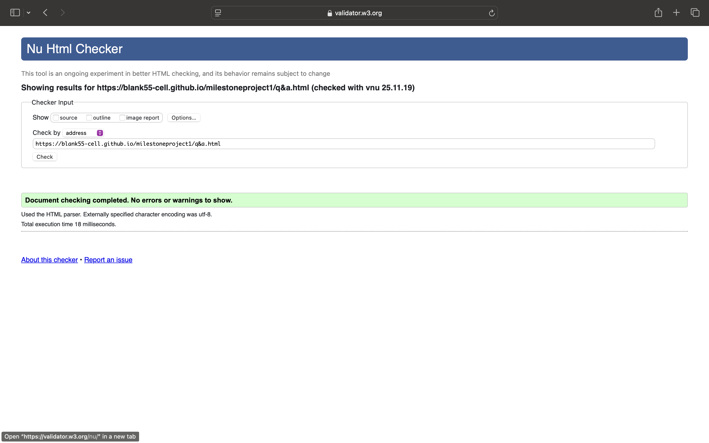
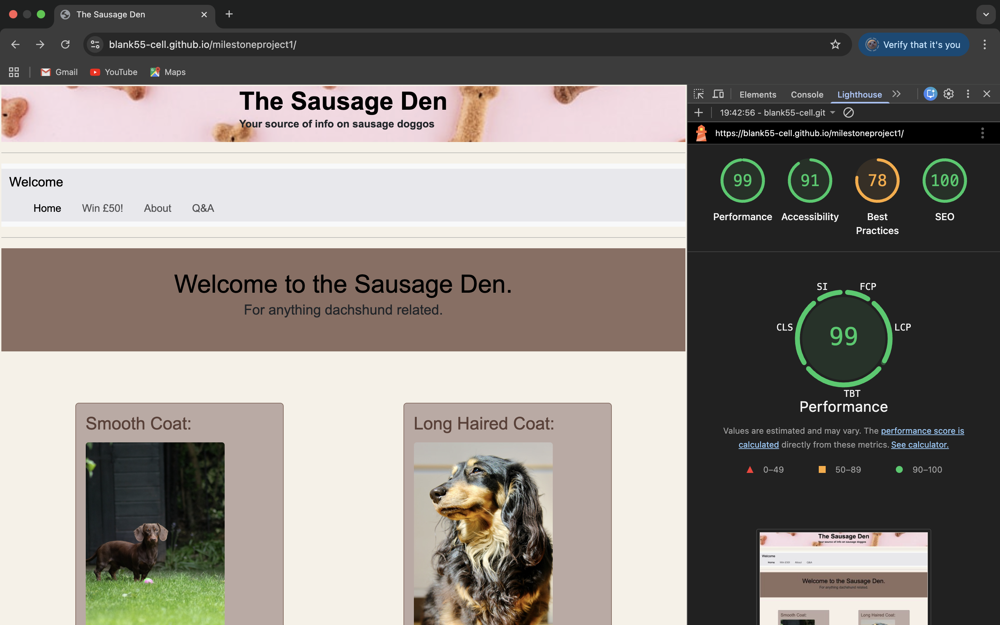

# The Sausage Den

> **Your source of info for our sausage doggos**  
A website dedicated to helping dachshund owners better understand their dogs’ coats, health risks, and care needs.  

---

## Quick Links
- [Main Goal](#main-goal)
- [Tools Used](#tools-used)
- [Project Objectives](#project-objectives)
- [Target Audience](#target-audience)
- [Credits](#credits)
- [Bug Fixes](#bug-fixes)
- [Changes Done to the Code/Layout](#changes-done-to-the-codelayout)
- [Site Pages Structure](#site-pages-structure)
  - [index.html – Home Page](#1-indexhtml--home-page)
  - [about.html – About Section](#2-abouthtml--about-section)
  - [q&a.html – Q&A Section](#3-qahtml--qa-section)
  - [formss.html – Registration Form](#4-formsshtml--registration-form)
- [Current Content](#current-content)
  - [Dachshund Coat Types](#dachshund-coat-types)
- [Common Symptoms Experienced by Dachshunds](#common-symptoms-experienced-by-dachshunds)
- [UX](#ux)
- [Site Structure](#site-structure)
- [Future Improvements](#future-improvements)
- [Website testing](#website-testing)

---

## Main Goal
The aim of creating this website is to provide a source of information that can help dachshund owners better understand the aspects of dachshunds and how they behave, and more importantly, the potential ailments they can develop.  

For example, complicated back problems are the more prevalent issues that can occur, with the most debilitating one being **IVDD (Intervertebral Disc Disease)**. This can lead to a costly and demoralizing journey, and for that reason I want to incorporate features that allow dachshund owners to enquire and better understand the potential risks of this disease and other ailments so that it can help reduce the potential risks of these issues occurring.

In summary, this website is being designed to better help dachshund owners understand how to look after their dogs' coats while explaining the potential health risks and care needs, allowing for easier navigation, FAQs, and resources to help support more responsible ownership.

---

## Tools Used
- HTML5  
- CSS  
- Bootstrap  
- GitHub  
- W3C (CSS & HTML)
- Claude AI to help understand location of an issue on dev tools (didnt let me access the issue as it was hidden and wouldnt let me get to it turns out it was an image not loading error 404)
- Chrome Lighthouse

---

## Project Objectives
- Provide a website that can fulfill the needs of dachshund owners  
- Deliver a useful and intuitive UI that helps visitors navigate with ease while providing answers to common questions  

---

## Target Audience
- Dachshund owners  

---

## Credits
Images used in this project:  

| Image | Photographer |
|-------|--------------|
| Wire-haired | [Sandra Grünewald](https://unsplash.com/photos/mZostdE4kUY) |
| Smooth-haired | [Hayden Patmore](https://unsplash.com/photos/ohz49NaR9kM) |
| Long-haired | [Darren Richardson](https://unsplash.com/photos/5IQ6cdiS3GM) |
| Dog-treats | [okeykat](https://unsplash.com/photos/w6elADh_jww) |
| Grass-2 | [Lorren & Loki](https://unsplash.com/photos/Bf07Cxq1aH0) |
| Dpuppy | [Carlos Ibáñez](https://unsplash.com/photos/-VscXAULPao) |

---

---

## Bug Fixes
| Bug / Issue | Cause | Fix Implemented |
|-------------|-------|-----------------|
| Broken iframe link (Google Maps embed) | Used a copied URL that wasn't properly formatted for embedding | Replaced with the official embed code provided by Google Maps |
| CSS h1 headers overriding each other | Multiple conflicting h1 rules | Merged into a single h1 rule |
| Duplicate CSS rules (section-history, section-socials) | Repeated selectors causing conflicts | Combined into single rules for each section |
| Wrong CSS property (line-height vs list-style) | Typo in property name | Corrected to line-height |
| Border not rendering | Forgot to add solid style | Fixed with border: 1px solid ... |
| CSS layering issues | Rules applied in wrong order | Reorganized CSS file for proper cascade |
| Image paths breaking | Folder restructuring changed relative paths | Updated src attributes to match new folder layout |
| Navbar breaking | Bootstrap collapse not working | Adjusted markup and IDs for proper Bootstrap behavior |
| Q&A section too CSS-heavy | Used buttons requiring extra styling | Simplified with `
` and `
` tags |
| General spelling mistakes in CSS | Typos in property names | Corrected manually and tested with validation tools |
| Excessive ` ` and empty `<label>` tags | Too many ` ` tags for spacing and unused empty labels cluttered the form | Removed extra ` ` tags and deleted empty labels to simplify the markup |
| `<select>` missing attributes | The `<select>` element had no id or name | Added `id="dachshundType"` and `name="dachshundType"`, plus `required` |
| `<option>` values incorrect | Options had empty values and one was misspelled (“Minature”) | Added meaningful values and fixed spelling |
| Radio button label mismatch | Labels pointed to the wrong id | Corrected labels so “Yes” links to `ageYes` and “No” links to `ageNo` |
| Email input type wrong | Email field used `type="text"` | Changed to `type="email"` with `required` |
| Inconsistent fieldset headings | Labels were used instead of `<legend>` | Replaced with `<legend>` elements |
| General cleanup | Duplicate attributes and inconsistent spacing | Removed duplicates, fixed spacing, and polished structure |
| Extra closing `</section>` after video block | Stray tag that didn’t match any open section | Removed the extra `</section>` |
| Empty `<h2>` in video section | Placeholder heading left blank | Added meaningful text: Video of Mimi |
| Duplicate aria attribute in Fun Facts link | Mistyped as `aria aria-label` | Corrected to a single `aria-label` |
| Alt text typo for Mimi’s image | “minature” misspelled | Updated to “miniature” |
| Alt text consistency for coat images | Missing hyphenation | Changed to “Smooth‑haired” and “Wire‑haired” |
| Video fallback text unclear | Contained only “Mimi:” | Added proper fallback text |
| Typos in text content | Words like “thats”, “occured”, “We.re” | Corrected to proper spelling |
| Meta keywords sloppy formatting | Extra spaces and trailing comma | Cleaned to `dog, sausage dog, dachshund` |
| Missing closing `</body>` before `</html>` | Body element wasn’t properly closed | Added `</body>` before `</html>` |

---

## Changes Done to the Code/Layout
- Replaced Bootstrap columns with custom ones for better control and cleaner code.  
- Simplified Q&A section by switching from buttons to `
` tags.  
- Fixed typos, improved accessibility with ARIA labels, and made images responsive.  
- Improved navbar collapse behavior on mobile.  
- Adjusted CSS for responsiveness across mobile, tablet, and desktop.  

---

## Site Pages Structure

### 1. `index.html` – Home Page
- Header with site name and tagline.  
- Navigation bar linking to all pages.  
- Main content:  
  - Dachshund coat types (smooth, long-haired, wire-haired).  
  - History of dachshunds.  
  - Fun facts (Olympic mascot, famous owners, lifespan).  
- Cross-links to Q&A for training and coat care.  
- Embedded Google Map.  
- Footer with social media links and copyright.  

---

### 2. `about.html` – About Section
- Header: *About Section – Why you can trust us*.  
- Image and story of Mimi, the dachshund behind the site.  
- Values: compassion, community, transparency.  
- Video section: *Watch Mimi in action* (iframe placeholder).  
- Testimonies: user quotes about improved coat health, reduced scratching, better diet.  

---

### 3. `q&a.html` – Q&A Section
- Interactive dropdown FAQs using `
` and `
`.  
- Topics covered: coat care, bathing, diet, grooming, exercise, separation anxiety.  
- Gallery of dachshunds (images of smooth-haired, wire-haired, puppy, Mimi).  
- Training tips dropdown: starting early, short sessions, positive reinforcement, consistency.  
- Footer: contact info and social links (Instagram, Facebook, Twitter).  

---

### 4. `formss.html` – Registration Form
- Header: *Registration Form*.  
- Form fields:  
  - Full Name (first and last, required).  
  - Dachshund type (dropdown: Miniature, Long Haired, Wire Haired, Smooth Haired).  
  - Age verification (radio buttons: Yes/No).  
  - Email address.  
- Submit button: *register*.  
- Purpose: community registration and prize draw entry.  

---

## Current Content For Paragraph Elements

### Dachshund Coat Types
*(Smooth, Long-haired, Wire-haired — positives and negatives)* 
#### Smooth Coat 
Smooth-haired Dachshunds have short, shiny hair that is very close to the skin. It's one of the most common types of coats. They require minimal grooming but offer little insulation, making them more prone to the cold.

**Positives:**
- Less prone to matting and very low maintenance 
- Coat requires minimal grooming

**Negatives:**
- Prone to the cold; needs further insulation during colder times of the year
- The sleek coat is more prone to damage due to being thinner compared to other variants
- Very noticeable shedding

#### Long-Haired Coat
Long-haired dachshunds have softer, flowing fur with a feathering coat. They feature bushier eyebrows and have a scruffier look, but due to these reasons, they require more grooming; otherwise, their coat may get matted. 

**Positives:**
- Softer texture compared to other coats
- Often considered more gentle in temperament

**Negatives:**
- Grooming takes extra time and effort, making it high maintenance
- Coat mats quickly if not properly maintained

#### Wire-Haired Coat
Wire-haired dachshunds have a rough, wiry outer coat with a softer undercoat. They have distinctive facial hair including eyebrows and a beard.

**Positives:**
- Weather-resistant coat
- Less shedding compared to smooth-haired

**Negatives:**
- Requires regular hand-stripping or professional grooming
- Can develop a strong odor if not properly maintained

## Common Symptoms Experienced by Dachshunds
- IVDD  
- Obesity  
- Hip Dysplasia & Patellar Luxation  
- Skin Conditions  
- Dental Disease  

### Intervertebral Disc Disease (IVDD)
- Common disc disease 
- Their long spine can lead to a higher chance of a slipped or herniated disc 
- Symptoms include: difficulty walking, yelping when moved or picked up, less inclined to move

### Obesity 
- Dachshunds gain weight very easily, which can lead to more pressure being placed on their spine and joints, causing them to wear down
- Heart disease and high blood pressure are also common with obesity

### Hip Dysplasia and Patellar Luxation
- Due to the way a dachshund's weight is distributed, it can ultimately lead to joints wearing down, causing arthritis
- Patellar luxation is the dislocation of the kneecap, causing limping and extreme pain

### Skin Conditions
- Skin conditions such as itching can occur as a result of allergies 
- Skin conditions can vary but are quite noticeable 
- Mites can burrow into the skin, causing discomfort and itching, resulting in patches forming

### Dental Disease 
- Small breeds in general suffer from tartar buildup, gum disease, and tooth loss

---

## UX
The user experience (UX) design of **The Sausage Den** focuses on:  
- Clarity: Simple navigation with clear headings and simple layout.  
- Accessibility: created a more responsive design using Bootstrap to ensure better usability across devices.  
- Consistency: Unified styling across sections helps in reducing confusion and helps the user to quickly get the information they need.  
- Engagement: Interactive Q&A section and gallery to keep users involved also have a couple of links from the home page that lead to the q&a page in order to better guide the visitor to the information they're looking for.  
- Empathy: Content tailored to dachshund owners’ real concerns (health, grooming, exercise) i made sure to include my own personal side in order to provide a level of personal experience that can build onto my original purpose for creating this website. 

- Balsamic wireframe link: 
View the project wireframes: [Wireframe Design](https://balsamiq.cloud/sr1qhq1/p3lcc0z)

---

## Website Testing

### Home page Validation 
  

### About Section

### Forms Section 

### Q&A Section 

### CSS testing 

### Lighthouse testing 
