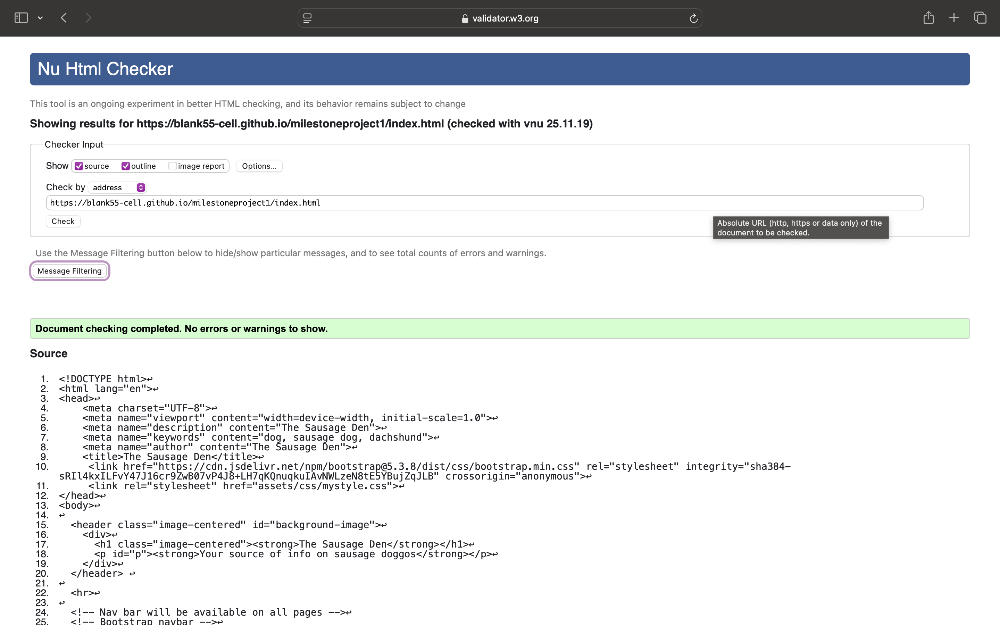
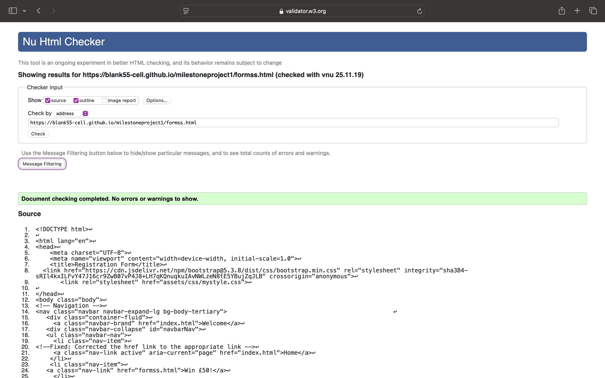
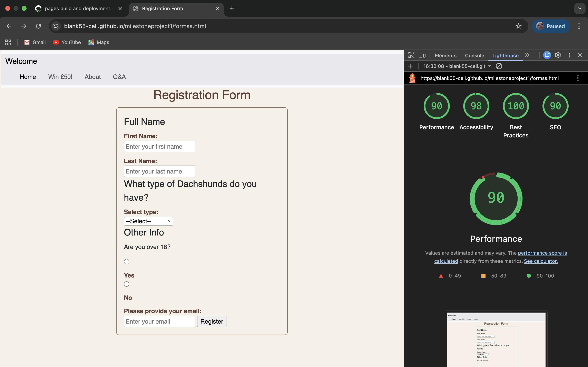
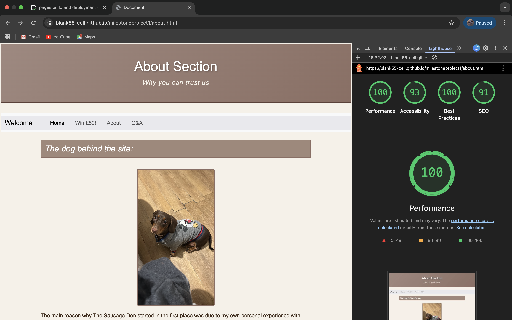
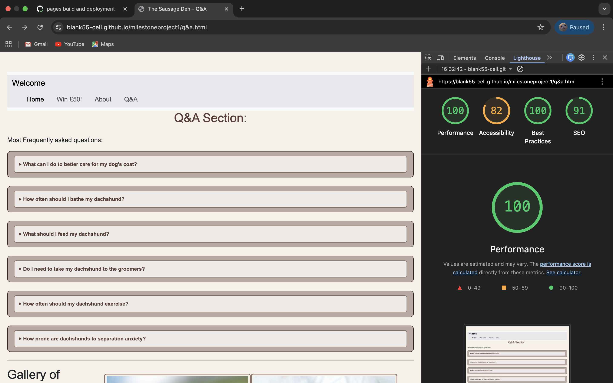

# The Sausage Den:

> **Your source of info for our sausage doggos**  
A website dedicated to helping dachshund owners better understand their dogs’ coats, health risks, and care needs.  

---

## Quick Links
- [Main Goal](#main-goal)
- [Tools Used](#tools-used)
- [Project Objectives](#project-objectives)
- [Target Audience](#target-audience)
- [Credits](#credits)
- [Bug Fixes](#bug-fixes)
- [Changes Done to the Code/Layout](#changes-done-to-the-codelayout)
- [Site Pages Structure](#site-pages-structure)
  - [index.html – Home Page](#1-indexhtml--home-page)
  - [about.html – About Section](#2-abouthtml--about-section)
  - [q&a.html – Q&A Section](#3-qahtml--qa-section)
  - [formss.html – Registration Form](#4-formsshtml--registration-form)
- [Current Content](#current-content)
  - [Dachshund Coat Types](#dachshund-coat-types)
- [Common Symptoms Experienced by Dachshunds](#common-symptoms-experienced-by-dachshunds)
- [UX](#ux)
- [Site Structure](#site-pages-structure)
- [Website testing](#website-testing)
- [Screenshots](#screenshots)
  - [Q&A + Lighthouse](#qa--lighthouse)
  - [Form + Lighthouse](#form--lighthouse)
  - [About + Lighthouse](#about--lighthouse)

---

## Main Goal
- The aim of creating this website is to provide a source of information that can help dachshund owners better understand the aspects of dachshunds and how they behave, and more importantly, the potential ailments they can develop.  

For example, complicated back problems are the more prevalent issues that can occur, with the most debilitating one being **IVDD (Intervertebral Disc Disease)**. This can lead to a costly and demoralizing journey, and for that reason I want to incorporate features that allow dachshund owners to enquire and better understand the potential risks of this disease and other ailments so that it can help reduce the potential risks of these issues occurring.

In summary, this website is being designed to better help dachshund owners understand how to look after their dogs' coats while explaining the potential health risks and care needs, allowing for easier navigation, FAQs, and resources to help support more responsible ownership.

---

## Tools Used
## Tools Used
- **Chrome DevTools** for debugging  
- **Chrome Lighthouse** for performance and accessibility checks  
- **W3C HTML & CSS Validators**  
- **Balsamiq** for wireframes  
- **Claude AI** used once to help identify a hidden 404 image path error  
- **CloudConvert** used to convert the video to MP4  

---

## Project Objectives
- Provide a website that can fulfill the needs of dachshund owners  
- Deliver a useful and intuitive UI that helps visitors navigate with ease while providing answers to common questions  

---

## Target Audience
- Dachshund owners  

---

## Credits
Images used in this project:  

| Image | Photographer |
|-------|--------------|
| wirehaired.jpg | [Sandra Grünewald](https://unsplash.com/photos/mZostdE4kUY) |
| smoothhaired.jpg | [Hayden Patmore](https://unsplash.com/photos/ohz49NaR9kM) |
| longhaired.jpg | [Darren Richardson](https://unsplash.com/photos/5IQ6cdiS3GM) |
| dogtreats.jpg | [okeykat](https://unsplash.com/photos/w6elADh_jww) |
| grass.jpg | [Lorren & Loki](https://unsplash.com/photos/Bf07Cxq1aH0) |
| dpuppy.jpg | [Carlos Ibáñez](https://unsplash.com/photos/-VscXAULPao) |

---

## Bug Fixes
| Bug / Issue | Cause | Fix Implemented |
|-------------|-------|-----------------|
| Broken iframe link (Google Maps embed) | Used a copied URL that wasn't properly formatted for embedding | Replaced with the official embed code provided by Google Maps |
| CSS h1 headers overriding each other | Multiple conflicting h1 rules | Merged into a single h1 rule |
| Duplicate CSS rules (section-history, section-socials) | Repeated selectors causing conflicts | Combined into single rules for each section |
| Wrong CSS property (line-height vs list-style) | Typo in property name | Corrected to line-height |
| Border not rendering | Forgot to add solid style | Fixed with border: 1px solid ... |
| CSS layering issues | Rules applied in wrong order | Reorganized CSS file for proper cascade |
| Image paths breaking | Folder restructuring changed relative paths | Updated src attributes to match new folder layout |
| Navbar breaking | Bootstrap collapse not working | Adjusted markup and IDs for proper Bootstrap behavior |
| Q&A section too CSS-heavy | Used buttons requiring extra styling | Simplified with `
` and `
` tags |
| General spelling mistakes in CSS | Typos in property names | Corrected manually and tested with validation tools |
| Excessive ` ` and empty `<label>` tags | Too many ` ` tags for spacing and unused empty labels cluttered the form | Removed extra ` ` tags and deleted empty labels to simplify the markup |
| `<select>` missing attributes | The `<select>` element had no id or name | Added `id="dachshundType"` and `name="dachshundType"`, plus `required` |
| `<option>` values incorrect | Options had empty values and one was misspelled (“Minature”) | Added meaningful values and fixed spelling |
| Radio button label mismatch | Labels pointed to the wrong id | Corrected labels so “Yes” links to `ageYes` and “No” links to `ageNo` |
| Email input type wrong | Email field used `type="text"` | Changed to `type="email"` with `required` |
| Inconsistent fieldset headings | Labels were used instead of `<legend>` | Replaced with `<legend>` elements |
| General cleanup | Duplicate attributes and inconsistent spacing | Removed duplicates, fixed spacing, and polished structure |
| Extra closing `</section>` after video block | Stray tag that didn’t match any open section | Removed the extra `</section>` |
| Empty `<h2>` in video section | Placeholder heading left blank | Added meaningful text: Video of Mimi |
| Duplicate aria attribute in Fun Facts link | Mistyped as `aria aria-label` | Corrected to a single `aria-label` |
| Alt text typo for Mimi’s image | “minature” misspelled | Updated to “miniature” |
| Alt text consistency for coat images | Missing hyphenation | Changed to “Smooth‑haired” and “Wire‑haired” |
| Video fallback text unclear | Contained only “Mimi:” | Added proper fallback text |
| Typos in text content | Words like “thats”, “occured”, “We.re” | Corrected to proper spelling |
| Meta keywords sloppy formatting | Extra spaces and trailing comma | Cleaned to `dog, sausage dog, dachshund` |
| Missing closing `</body>` before `</html>` | Body element wasn’t properly closed | Added `</body>` before `</html>` |
| Hidden image loading error 404 | Dev tools wouldn't allow access to the hidden error; image file was missing or path was incorrect | Used Claude AI to identify the hidden 404 error; corrected the image path/file |

---

## Changes Done to the Code/Layout
- Replaced Bootstrap columns with custom ones for better control and cleaner code.  
- Simplified Q&A section by switching from buttons to `
` tags.  
- Fixed typos, improved accessibility with ARIA labels, and made images responsive.  
- Improved navbar collapse behavior on mobile.  
- Adjusted CSS for responsiveness across mobile, tablet, and desktop.  

---

## Site Pages Structure

### 1. `index.html` – Home Page
- Header with site name and tagline.  
- Navigation bar linking to all pages.  
- Main content:  
  - Dachshund coat types (smooth, long-haired, wire-haired).  
  - History of dachshunds.  
  - Fun facts (Olympic mascot, famous owners, lifespan).  
- Cross-links to Q&A for training and coat care.  
- Embedded Google Map.  
- Footer with social media links and copyright.  

---

### 2. `about.html` – About Section
- Header: *About Section – Why you can trust us*.  
- Image and story of Mimi, the dachshund behind the site.  
- Values: compassion, community, transparency.  
- Video section: *Watch Mimi in action* (iframe placeholder).  
- Testimonies: user quotes about improved coat health, reduced scratching, better diet.  

---

### 3. `q&a.html` – Q&A Section
- Interactive dropdown FAQs using `
` and `
`.  
- Topics covered: coat care, bathing, diet, grooming, exercise, separation anxiety.  
- Gallery of dachshunds (images of smooth-haired, wire-haired, puppy, Mimi).  
- Training tips dropdown: starting early, short sessions, positive reinforcement, consistency.  
- Footer: contact info and social links (Instagram, Facebook, Twitter).  

---

### 4. `formss.html` – Registration Form
- Header: *Registration Form*.  
- Form fields:  
  - Full Name (first and last, required).  
  - Dachshund type (dropdown: Miniature, Long Haired, Wire Haired, Smooth Haired).  
  - Age verification (radio buttons: Yes/No).  
  - Email address.  
- Submit button: *register*.  
- Purpose: community registration and prize draw entry.  

---

## Current Content For Paragraph Elements

### Dachshund Coat Types
*(Smooth, Long-haired, Wire-haired — positives and negatives)* 
#### Smooth Coat 
Smooth-haired Dachshunds have short, shiny hair that is very close to the skin. It's one of the most common types of coats. They require minimal grooming but offer little insulation, making them more prone to the cold.

**Positives:**
- Less prone to matting and very low maintenance 
- Coat requires minimal grooming

**Negatives:**
- Prone to the cold; needs further insulation during colder times of the year
- The sleek coat is more prone to damage due to being thinner compared to other variants
- Very noticeable shedding

#### Long-Haired Coat
Long-haired dachshunds have softer, flowing fur with a feathering coat. They feature bushier eyebrows and have a scruffier look, but due to these reasons, they require more grooming; otherwise, their coat may get matted. 

**Positives:**
- Softer texture compared to other coats
- Often considered more gentle in temperament

**Negatives:**
- Grooming takes extra time and effort, making it high maintenance
- Coat mats quickly if not properly maintained

#### Wire-Haired Coat
Wire-haired dachshunds have a rough, wiry outer coat with a softer undercoat. They have distinctive facial hair including eyebrows and a beard.

**Positives:**
- Weather-resistant coat
- Less shedding compared to smooth-haired

**Negatives:**
- Requires regular hand-stripping or professional grooming
- Can develop a strong odor if not properly maintained

## Common Symptoms Experienced by Dachshunds
- IVDD  
- Obesity  
- Hip Dysplasia & Patellar Luxation  
- Skin Conditions  
- Dental Disease  

### Intervertebral Disc Disease (IVDD)
- Common disc disease 
- Their long spine can lead to a higher chance of a slipped or herniated disc 
- Symptoms include: difficulty walking, yelping when moved or picked up, less inclined to move

### Obesity 
- Dachshunds gain weight very easily, which can lead to more pressure being placed on their spine and joints, causing them to wear down
- Heart disease and high blood pressure are also common with obesity

### Hip Dysplasia and Patellar Luxation
- Due to the way a dachshund's weight is distributed, it can ultimately lead to joints wearing down, causing arthritis
- Patellar luxation is the dislocation of the kneecap, causing limping and extreme pain

### Skin Conditions
- Skin conditions such as itching can occur as a result of allergies 
- Skin conditions can vary but are quite noticeable 
- Mites can burrow into the skin, causing discomfort and itching, resulting in patches forming

### Dental Disease 
- Small breeds in general suffer from tartar buildup, gum disease, and tooth loss

---

## UX
The user experience (UX) design of **The Sausage Den** focuses on:  
- Clarity: Simple navigation with clear headings and simple layout.  
- Accessibility: created a more responsive design using Bootstrap to ensure better usability across devices.  
- Consistency: Unified styling across sections helps in reducing confusion and helps the user to quickly get the information they need.  
- Engagement: Interactive Q&A section and gallery to keep users involved also have a couple of links from the home page that lead to the q&a page in order to better guide the visitor to the information they're looking for.  
- Empathy: Content tailored to dachshund owners’ real concerns (health, grooming, exercise) i made sure to include my own personal side in order to provide a level of personal experience that can build onto my original purpose for creating this website. 

- Balsamic wireframe link: 
View the project wireframes: [Wireframe Design](https://balsamiq.cloud/sr1qhq1/p3lcc0z)

---

## Website Testing

### Home page Validation 
  

### About Section

### Form Section 

### Q&A Section 

### CSS testing 

---

### Lighthouse testing 

--

# Test Plan & Manual Testing Procedure

Below is a record of the manual testing carried out across all four pages of the site.  
Tests focus on functionality, usability, and responsiveness.  
Some small syntax‑style issues were found during testing and corrected.

---
## Home Page — `index.html`

| Test Category | Feature | Test Description | Expected Result | Actual Result |
|--------------|---------|------------------|----------------|---------------|
| Functionality | Navbar links | Clicked through each link. | All links should work. | All fine, but the “Win £50!” link had an extra space inside the `<a>` tag. |
| | Header section | Checked the heading and intro text. | Should display properly. | Looked good, though `
` had some odd spacing from extra whitespace. |
| | Coat type images | Made sure all images load. | All images should load. | One image path had a capital letter, so it briefly showed as broken. |
| | Fun Facts link | Tested the link to Q&A. | Should navigate correctly. | Worked, but the `aria-label` had a small typo. |
| | Google Maps iframe | Checked the map embed. | Should load normally. | Loaded, but the fixed width caused horizontal scrolling. |
| | Footer links | Tried each social link. | Should open in new tabs. | All worked, but one link was missing `rel="noopener"`. |
| Usability | Headings | Looked over heading order. | Should follow a clear structure. | Two `<h2>` tags had uneven margins. |
| | Paragraphs | Checked readability. | Should be easy to read. | One paragraph had an unnecessary ` ` tag. |
| | Alt text | Reviewed alt descriptions. | Should be descriptive. | One alt text missing a hyphen. |
| | Keyboard navigation | Tabbed through the page. | Should follow a logical order. | Focus jumped once because of an empty `
`. |
| Responsiveness | Navbar collapse | Tested on mobile. | Should collapse properly. | Worked, but the toggle icon sat slightly off‑center. |
| | Coat type boxes | Checked how boxes stack. | Should stack neatly. | One box had extra margin pushing it out of line. |
| | Images | Tested image scaling. | Should resize properly. | One image had an inline width stopping it from scaling. |
| | Iframe | Checked on mobile. | Should not overflow. | Overflow happened due to fixed width. |
| | Footer layout | Checked spacing. | Should stack neatly. | Footer links felt a bit cramped. |

## Registration Form — `formss.html`

| Test Category | Feature | Test Description | Expected Result | Actual Result |
|--------------|---------|------------------|----------------|---------------|
| Functionality | Navbar links | Clicked each link. | All links should work. | All fine, but the “Home” link had extra spacing inside the `<li>`. |
| | First Name field | Tested required field. | Should not allow empty submission. | Worked, but the placeholder sat slightly off due to padding. |
| | Last Name field | Same test. | Should validate correctly. | Worked fine. |
| | Dropdown | Tested required attribute. | Should require a selection. | Worked, but the `<option>` tags were indented inconsistently. |
| | Radio buttons | Tested Yes/No. | Only one selectable. | Worked, but labels didn’t line up because they weren’t set to `inline-block`. |
| | Email field | Tried invalid emails. | Should reject invalid formats. | Error outline looked clipped because of input styling. |
| | Submit button | Tested form submission. | Should only submit when valid. | Worked, but the button shifted slightly when pressed due to `:active` styling. |
| Usability | Fieldsets | Checked grouping. | Should be clear. | Clear enough, but spacing between fieldsets was inconsistent. |
| | Labels | Tested label focus. | Should focus the right input. | One label had the wrong `for=""` value. |
| | Placeholder text | Checked clarity. | Should be readable. | Email placeholder got cut off on small screens. |
| | Keyboard navigation | Tabbed through fields. | Should follow logical order. | Focus skipped the dropdown because of a stray ` `. |
| | Error visibility | Triggered validation. | Errors should be visible. | Error bubble overlapped the navbar due to absolute positioning. |
| Responsiveness | Navbar collapse | Tested on mobile. | Should collapse properly. | Worked fine. |
| | Form layout | Checked stacking. | Should stack neatly. | Inputs stacked but spacing was tight. |
| | Input widths | Checked overflow. | Should not overflow. | Radio buttons wrapped awkwardly because of fixed width. |
| | Submit button | Checked tap size. | Should be easy to tap. | Slightly too close to the email field. |

## Q&A Page — `q&a.html`

| Test Category | Feature | Test Description | Expected Result | Actual Result |
|--------------|---------|------------------|----------------|---------------|
| Functionality | Navbar links | Clicked each link. | All links should work. | Q&A link briefly showed `&amp;` in the URL. |
| | FAQ dropdowns | Opened each `
`. | Should open/close smoothly. | One dropdown needed a second click because a closing tag was missing. |
| | FAQ content | Checked formatting. | Should display correctly. | One list item missing `</li>`. |
| | Gallery images | Checked loading. | All images should load. | One image path ended in `.jp` instead of `.jpg`. |
| | Training tips dropdown | Tested expand/collapse. | Should work normally. | Worked, but indentation looked uneven. |
| | Footer links | Tested external links. | Should open in new tabs. | One link missing `rel="noopener"`. |
| Usability | Page heading | Checked spacing. | Should be clear. | Extra space before the colon. |
| | FAQ readability | Checked spacing. | Should be readable. | One `
` missing a closing tag. |
| | Keyboard navigation | Tabbed through page. | Should follow logical order. | Focus skipped one FAQ due to a stray ` `. |
| | Alt text | Checked alt attributes. | Should be descriptive. | One typo (“dachshud”). |
| | Footer email | Checked link. | Should be usable. | Missing `mailto:`. |
| Responsiveness | Navbar collapse | Tested on mobile. | Should collapse properly. | One class misspelled (`navbr`). |
| | FAQ spacing | Checked on mobile. | Should be spaced evenly. | One inline style missing a semicolon. |
| | Gallery layout | Checked wrapping. | Should wrap cleanly. | One image had a fixed width causing overflow. |
| | Image scaling | Checked resizing. | Should scale properly. | One image missing `max-width: 100%`. |
| | Footer layout | Checked stacking. | Should stack neatly. | One `<li>` nested incorrectly. |

## About Page — `about.html`

### **Manual Testing**

| Test Category | Feature | Test Description | Expected Result | Actual Result |
|--------------|---------|------------------|----------------|---------------|
| **Functionality** | Navbar links | Clicked each link. | All links should work. | About link had inconsistent spacing inside the `<a>` tag. |
| | Mimi image | Checked if image loads. | Should load correctly. | Loaded, but filename originally used uppercase letters. |
| | Video section | Checked placeholder. | Should display correctly. | Worked, but one `<h2>` was left empty. |
| | Testimonies | Checked formatting. | Should display normally. | One quote missing a closing quotation mark. |
| | Footer links | Tested social links. | Should open in new tabs. | One link missing `rel="noopener"`. |
| **Usability** | Page heading | Checked clarity. | Should be readable. | Heading spacing slightly uneven. |
| | Story paragraph | Checked readability. | Should be easy to read. | One sentence missing a period. |
| | Keyboard navigation | Tabbed through page. | Should follow logical order. | Focus jumped because of an empty `
`. |
| | Alt text | Checked alt attribute. | Should be descriptive. | One typo (“minature”). |
| **Responsiveness** | Navbar collapse | Tested on mobile. | Should collapse properly. | Worked fine. |
| | Image scaling | Checked resizing. | Should scale properly. | Slight stretching due to fixed height. |
| | Video section | Checked layout. | Should not overflow. | Overflow caused by fixed width. |
| | Footer layout | Checked stacking. | Should stack neatly. | Footer text felt a bit cramped. |

---

## Deployment

### GitHub Pages Deployment

The site was deployed using **GitHub Pages**.  
Here are the steps I followed to publish the project:

1. Open the GitHub repository for the project.
2. Click on **Settings** in the top navigation bar.
3. Select **Pages** from the left-hand menu.
4. Under **Source**, choose:
   - **Branch:** `main`
   - **Folder:** `/root` (default)
5. Click **Save**.
6. After a few moments, GitHub Pages generated a live link to the website.

**Live Site:**  
https://blank55-cell.github.io/milestoneproject1/
- **Live Site** 

---

### Running the Project Locally

To run the project on your own machine:

1. Go to the GitHub repository.
2. Click the green **Code** button.
3. Choose one of the following:
   - **Download ZIP** and extract it  
   - Copy the **HTTPS** link and clone it using Git
4. Open the project folder in your code editor.
5. Open `index.html` in your browser to view the site locally.

---

# Design Comments

These notes explain some of the choices I made while building **The Sausage Den**, and why the site looks and works the way it does. I wanted to keep things simple, clear, and easy to follow, even if that meant making a few changes along the way.

## General Design Choices
- I built the site with a **mobile‑first mindset**, since most people browse on their phones and I wanted everything to scale nicely without having to re-do layouts later.
- I used **semantic HTML** (sections, headers, footers, fieldsets, legends, etc.) to keep the structure clear and more accessable.
- Bootstrap is used mainly for the **navbar and basic responsiveness**, but most of the layout is done with my own CSS so I could control spacing and styling more easily.

## Home Page
- The home page uses a **hero banner** to set the tone and make the site feel welcoming right away.
- The coat‑type boxes are laid out using **custom flexbox styling** instead of Bootstrap’s grid because it gave me more control over spacing and how things lined up.
- I added small **cross‑links** (like Fun Facts → Q&A) to help guide visitors to the info they’re looking for without making them search around.
- A few images use **inline styles** for quick adjustments without creating extra CSS classes that weren’t really neccessary.

## Q&A Page
- I switched from buttons to **`
` and `
`** because they’re simpler, more accessable, and don’t need JavaScript.
- The gallery is built with a **custom responsive layout** so the images wrap neatly on all screen sizes.
- I added hover effects and warm colours to make the page feel a bit more interactive and friendly.

## About Page
- The header uses a **gradient background** to give the page a bit more personality and make it stand out.
- The photo of Mimi is my own, so no attribution is needed.
- I converted the video to **MP4** so it works across all browsers without issues.
- I used **`<blockquote>`** for the testimonies to make them stand out and read more naturally.

## Form Page
- I used **fieldset and legend** elements to group related inputs and make the form easier to follow.
- I relied on **built‑in HTML validation** (like `required` and `type="email"`) instead of JavaScript to keep things simple and avoid unneccessary scripts.
- Radio buttons were used for the age question because they make the choice clear and avoid confusion.
- The form doesn’t submit anywhere (`action="#"`) because the project focuses on front‑end structure only.

## CSS Choices
- I chose a warm, earthy **colour palette** to match the friendly theme of the site and the natural tones of dachshunds.
- The gallery uses **flexbox + media queries** so the layout adapts smoothly from desktop to tablet to mobile.
- I used **gradients, borders, and soft colours** to give the site a warm, approachable feel without making it look too busy.
- Typography and spacing were adjusted to keep everything readable and not too cramped.
- Most sections use **custom classes** so I could keep the layout consistent across pages and avoid repeating myself unneccessarily.

---

# Code Attributions and Credits

## Frameworks & Libraries
- **Bootstrap 5.3.8** (CSS & JS) via CDN  
  https://getbootstrap.com

## Code References
- All HTML, CSS, and layout decisions were written by me.
- External code includes:
  - Bootstrap navbar structure and responsive behaviour (from https://getbootstrap.com)
  - Google Maps embed code (generated via Google Maps “Share -> Embed a map”)
  - Form validation guidance from MDN Web Docs (https://developer.mozilla.org)
- Claude AI was used once to identify a hidden image path error.
- All Unsplash images are credited in the Credits section.

## Images
All Unsplash images are credited in the Credits table.  
`mimi.jpeg` and `mimivid.mp4` are my own files.
